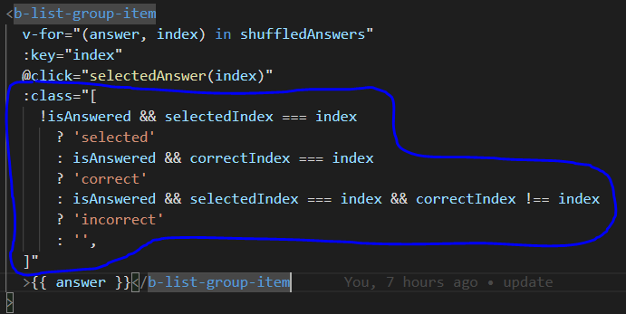
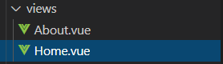

# **`VueJsDojo`**

## **`VueJs(V.2)`**

=> front-end framework ที่เอาไว้ทำ Web Application โดยใช้ Javascript ในการเขียน

## **`Why VueJs?`**

- เขียนด้วย HTML,CSS,Javascript ที่ใช้เขียนในหลายๆ framework
- เขียนง่าย Learning curve ไม่สูง
- มีขนาดของ project ที่เล็ก (ไม่กี่ KBs)
- implement บน Virtual DOM ที่มีประสิทธิภาพในการอัพเดท DOM (Document Object Model)
- แยก UI, Business Logic ออกจากกัน
- fast dev เพราะเป็น reuseable code

`Note : ` DOM (Document Object Model) คือ Object ของ HTML ที่ Web Browser สร้างขึ้นมาเมื่อหน้าเว็บโหลดเสร็จ

- tag ต่างๆใน HTML จะเรียกว่า Element(DOM)
- เราใช้ DOM HTML ในการเข้าถึง Element(tag) ต่างๆ ผ่านคำสั่งของ Javascript

## **`Basic For VueJs`**

## _`Vue Instance`_

=> เป็น Object ที่สร้างจาก `new Vue()` โดยข้างในก็จะมี property ต่างๆที่จัดการเกี่ยวกับ view model

- property el จะ ref ถึง element ใน DOM
- property data จะ ref data ของ component
- binding data ใช้ `{{ }}` ครอบ data ที่ต้องการจะ bind

## _`Directives`_

### **v-model**

=> เป็นการ binding แบบ Two-Way data

### **v-if**,**v-else-if**,**v-else**

`Note : ` `v-if`, `v-else-if`, `v-else` มันจะ render เฉพาะ DOM Element ที่เข้าเงื่อนไขเท่านั้น DOM Element ไหนที่ไม่เข้าเงื่อนไขจะไม่ถูกเอามา render

### **v-show**

`Note : ` v-show ไม่ว่าจะเข้าหรือไม่เข้าเงื่อนไขมันก็ถูก render เหมือนกันหมด เพียงแต่ว่าถ้าไม่เข้าเงื่อนไขมันจะถูก render แต่ไม่เอามาแสดง (`จะถูก set css display : none ไว้`)

### **v-bind**

=> v-bind เป็นคำสั่งที่เอาไว้ binding HTML Attribute

`Note : ` v-bind สามารถเขียนแบบย่อได้ `v-bind:disabled` -> `: disabled`

`Note : ` ถ้าเราอยากจะทำ dynamic v-bind ให้เราใส่ [ ] ครอบคำสั่งที่เราต้องการจะทำ dynamic

### **v-text**

=> เป็นคำสั่งที่เอาไว้ binding text จะเหมือนกับการ binding ด้วย `{{ }}`

### **v-html**

=> เป็นคำสั่งที่เอาไว้ binding html

### **v-once**

=> เป็นคำสั่งที่เอาไว้ render DOM Element แค่ 1 ครั้งที่มันถูกสร้างและเป็น static ไม่มีการเปลี่ยนแปลงอีก

### **v-for**

=> เป็นคำสั่งที่เอาไว้ทำ loop

`Note : ` สามารถกำหนด index ได้ จาก parameter ตัวที่ 2

`Note : ` ในการ render ด้วย v-for จะต้อง `v-bind:key`, `:key` ให้แต่ละ element ด้วย ไม่งั้น vueJs จะ error ไม่สามารถ render ได้ (`vueJs ต้องการ key เพื่อ access เข้าถึง DOM Element แต่ละตัวได้`)

## _`Methods`_

=> เป็น property ของ vue instance ที่เอาไว้เขียน function ต่างๆ

## _`Data-Binding`_

### **simple binding**

=> ใช้ `{{ }}` ครอบ data ที่ต้องจะ bind

### **v-model**

=> เป็นการ binding แบบ Two-Way data

### **binding logic with VueJs Directive**

=> เราสามารถ binding logic ใน VueJs Directive ได้ด้วยการใส่ `[ ]` ครอบ logic

`Note : ` แต่เพื่อความ clean code เค้าจะไม่นิยมเขียน Logic ใส่ไปใน VueJs Directive กัน แต่จะเขียนเป็น function แล้วโยนไปใช้ binding แทน ตามตัวอย่างข้างล่างนี้

## _`Events`_

=> ในการ binding event จะใช้ `v-on:event`

`Note : ` สามารถเขียนแบบย่อได้ `v-on:click` => `@click` เป็นต้น

### **click**

=> เป็น event ที่เกิดจากการ click => `v-on:click`, `@click`

### **keyup**

=> เป็น event ที่เกิดจากการพิมพ์อะไรก็ได้ => `v-on:keyup`, `@keyup`

`Note : ` เราสามารถ specific การ keyup ของเราได้ เช่น `v-on:keyup.enter`, `@keyup.enter` เป็นต้น

## _`Filters`_

=> เป็น property ของ vue instance ที่เอาไว้เขียน function ต่างๆ ที่จัดการเกี่ยวกับ pipe (`เปลี่ยนแปลงการ display data ที่ render ออกมา show โดยที่ data ไม่ได้เปลี่ยน value`)

`Note : ` จากตัวอย่างข้างบนจะเห็นว่า pipe จะทำการส่ง `cat.name` เข้ามาเป็น parameter `value` ใน function capitalize

`Note : ` สามารถทำ multi pipe หลายๆ function ได้ (`ทำ function ตามลำดับ pipe`)

## _`Computed Properties`_

=> เป็น property ของ vue instance ที่เอาไว้กำหนด property ที่ต้องจัดการ logic ซับซ้อน, จัดการเกี่ยวกับการ update ค่าต่างๆ ส่วนใหญ่จะเอาไว้จัดการเกี่ยวกับ state ของ `VueX` แล้วเอาไป binding HTML เพื่อ render แสดงออกมา เราจะเอามาจัดการที่นี่เพื่อความ clean code, reuseable code แทนการไปจัดการที่ data property ของ vue instance

`Note : ` เอาไว้กำหนด property ที่มีการ share data จากส่วนกลาง เช่น VueX, LocalStorage เป็นต้น เนื่องจาก data พวกนี้สามารถเปลี่่ยนแปลงและถูก update ได้ตลอดเวลา ถ้าเราไปจัดการหรือกำหนดที่ data property มันจะทำแค่คร้้งเดียวคือตอนที่ initial หน้านั้น หรือ component นั้นขึ้นมา ทำให้ถ้ามันมีการเปลี่ยนแปลงหรือ update มันจะไม่สามารถ keep track data ที่เปลี่ยนแปลงได้ ซึ่ง `computed property` ถูกสร้างมาเพื่อสิ่งนี้

`Note : ` เอาไว้ keep track data อะไรซักอย่าง แล้วจัดการ Logic กับ data นั้นก่อนจะ return ไปใช้เป็น computed property

## _`Components`_

=> เป็นชิ้นส่วนเล็กๆ ที่มาประกอบรวมกันจนกลายเป็น page

`Note : ` สิ่งที่ควรรู้เกี่ยวกับ component

- ทุกครั้งที่จะเอา component ไปใช้ที่ page ต้อง declare ที่ `component property` ของ vue instance เสมอ
- เราสามารถส่งค่าระหว่าง component ผ่าน props (`HTML Attribute ที่เอาไว้ส่งค่าระหว่าง component`)
- เรา binding props ด้วย `v-bind:props = ค่าที่จะส่ง`, `:props = ค่าที่จะส่ง`
- component จะรับค่า props ต่างๆที่ส่งเข้ามาผ่าน `props property` ของ component

## _`Component Lifecycle`_

=> จะมี 4 life cycle

- created -> จะถูกเรียกเมื่อ component เริ่ม initialize (`ถูกสร้าง`)
- mounted -> จะถูกเรียกเมื่อ component initialize เสร็จ (`สร้างเสร็จ`)
- updated -> จะถูกเรียกเมื่อ state หรือ data มีการเปลี่ยนแปลง (`data มีการเปลี่ยแปลง`)
- destroyed -> จะถูกเรียกเมื่อ component ถูกทำลาย

## _`Watched Property`_

=> เป็น property ของ vue instance ที่เอาไว้เขียน function ที่เกี่ยวกับการ keep track การเปลี่ยนแปลงของ props (`ถ้า props ที่ parent component มีการเปลี่ยนแปลง มันจะเข้ามา run function ใน watch property`)

`Note : ` สามารถเขียน watcher ได้ 2 Approach

- `function`

  > 
  >
  > => watch แบบ function จะทำก็ต่อเมื่อ props มีการเปลี่ยนแปลง

- `object`

  > 
  >
  > => watch แบบ object จะทำก็ต่อเมื่อ props มีการเปลี่ยนแปลงเหมือนกัน เพียงแต่เราสามารถ config ให้มันทำงานได้เลยตั้งแต่ส่งค่ามาคร้้งแรก
  >
  > - `immediate` => เป็น property ที่เอาไว้ set ว่าจะให้มันทำงานใน watch เลยมั้ยตั้งแต่คร้้งแรกที่ส่ง props เข้ามา (`true`) ถ้าไม่ (`false`)
  > - `handler()` => เป็นส่วนที่เอาไว้จัดการ logic

# **`VueJs`**

## **`Structure`**

### _`package.json`_

=> เป็นไฟล์ที่มีรายละเอียดพวก dependency ต่างๆที่เราลง,script ต่างๆที่เราใช้ run,เครื่องมือ tool ต่างๆที่ถูก set ไว้ในตัว project นี้

### _`node_modules`_

=> เป็น folder ที่เก็บ package ต่างๆของ node

### _`public`_

=> เป็น folder ที่เก็บไฟล์ public ต่างๆ เช่น index.html (`main template`),พวกรูปภาพ,โลโก้

### _`src`_

=> เป็น folder ที่เราใช้ในการทำงานต่างๆบน VueJs จะประกอบไปด้วย

- folder assets -> ที่เอาไว้เก็บพวกไฟล์รูปต่างๆ
- folder components -> ที่เอาไว้เก็บ component ที่จะใช้ใน VueJs ทั้งหมด
- App.vue -> เป็น root component
- main.js -> เป็นส่วนที่ render ตัว root component (`App.vue`) ให้ไปแสดงที่ index.html (`main template`) ผ่านการ mount DOM Element ด้วย `id="app"`

### _`index.html(ใน folder public)`_

=> เป็น main template ของ Web Application

## **`Component`**

=> จากรูปข้างบน structure component จะแบ่งออกเป็น 3 ส่วน

- `template` -> เป็นส่วนที่เอาไว้เขียน HTML

  `Note : ` ใน template สามารถมี tag element container ได้เพียง 1 ตัวเท่านั้น (`ต้องมีตัว tag container ครอบทุก tag ได้แค่ 1 ตัว`)

- `script` -> เป็นส่วนที่เอาไว้เขียน javascript
- `style` -> เป็นส่วนที่เอาไว้เขียน CSS

  `Note : ` การกำหนด `scoped` ให้กับ tag style เป็นการบอกว่า css ที่ใช้จะใช้แค่ใน component นี้เท่านั้น ไม่ส่งผลต่อ global scope

`Note : ` สามารถใช้ Bootstrap Vue เข้ามาช่วยในการจัดการ css ได้

`Note : ` library fetch ที่เอาไว้จัดการเกี่ยวกับการดึง,ส่งข้อมูลกับ API เป็น standard library ที่มาพร้อมกับ node_module package ไม่ต้อง import เพิ่ม

### **`Property in component`**

- `data` -> เป็น object ที่เก็บข้อมูลของ component
- `created` -> เป็น life cycle ที่จะถูกเรียกตอนสร้าง component
- `mounted` -> เป็น life cycle ที่จะถูกเรียกเมื่อ component สร้างเสร็จ
- `updated` -> เป็น life cycle ที่จะถูกเรียกเมื่อ state หรือ data ของ `component` มีการเปลี่ยนแปลง
- `destroyed` -> เป็น life cycle ที่จะถูกเรียกเมื่อ component ถูกทำลาย
- `filters` -> เป็น object ที่เอาไว้เขียน function pipe
- `methods` -> เป็น object ที่เอาไว้เขียน function จัดการเกี่ยวกับ event หรือ logic ต่างๆ
- `computed` -> เป็น object ที่เอาไว้เขียน property ที่มีการเปลี่ยนแปลงและต้องการ keep track data และนำ property ใน computed ไปใช้ต่อ
- `props` -> เป็น array หรือ object ที่เอาไว้ declare props ที่รับส่งค่าจาก parent component
- `component` -> เป็น array ที่เอาไว้ declare component อื่นที่ต้องการจะใช้บน parent component

## **`Vue Devtool`**

=> เป็น extension สำหรับการ inspect data บน component

## **`Props & Slots`**

### _`Props`_

=> ค่าที่ส่งระหว่าง component ไม่ว่าจะเป็น primitive type data ต่างๆ หรือจะเป็น function, object ก็ได้

- ในการส่ง props จาก parent component ไปที่ child component จะส่งค่าผ่าน HTML Attribute (`ใช้ v-bind ในการ binding`)
- ในการรับ props จาก parent component มาที่ child component จะรับได้ 2 Approach ซึ่งรับผ่าน `props property`

1. รับมาเป็น Array

2. รับมาเป็น Object

## **`Vuex & Vue-Router`**

`Note : ` router, vuex จะถูก config ไว้ที่ main.js โดยจะถูกส่งเป็น property ของ vue instance (`ถูก set เป็น option ของ vue instance`)

- router
- store (`for vuex`)

### **`Structure`**

1. folder `views` => จะเป็นที่เก็บ page ทั้งหมดของ App

2. folder `components` => จะเป็นที่เก็บ component ทั้งหมด ที่จะเอามาใช้ในแต่ละ view(`page`)

`Note : ` ในแต่ละ view สามารถเอา component มาใช้ standalone ของใครของมันได้ ทำให้เกิด reuseable code ขึ้น (`component ที่สร้างขึ้นสามารถเอาไปใช้ซ้ำที่ view ไหนก็ได้ คือเขียนครั้งเดียวแต่สามารถนำไปใช้กับหลายๆที่ได้นั่นเอง`)

3. `index.js` ใน folder `router` => เป็นที่สำหรับ config path route ในการเข้าถึงหน้าของแต่ละ view(`page`)

- ใช้กำหนด route ให้แต่ละ view
- ใช้ทำ Lazy loading (`การ group component เพื่อที่ตอน initialize App ขึ้นมาจะได้ไม่ต้อง load ทุก component ทั้งหมดมาทีเดียวตอนเปิด App ครั้งแรก แต่จะค่อยๆ load ทีละ group component ที่มีการเรียกใช้`)

`Note : ` view มันก็คือ component ที่เป็น page

3. `index.js` ใน folder `store` => เป็นไฟล์ของ vuex ที่เอาไว้แชร์ data ที่ต้องการเอาไปใช้ในหลายๆ view หลายๆ component

### **`Route`**

=> เป็นการกำหนด route path ในการเข้าถึงหน้าของแต่ละ view

`Note : ` เป็นการกำหนดว่าถ้าเข้ามาด้วย path นี้จะต้องเอา view หรือ component อันไหนมา render

### **`Dynamic Route Matching`**

## **`Trick and Tips`**

- การใส่ `@` ในการ ref path ของไฟล์ โดย `@` หมายถึง folder `src` (`เป็น syntax ของ vue cli`)

  `Note : ` การใช้ `@` จะช่วยทำให้เราเขียน ref path file ได้สะดวกขึ้นสั้นขึ้น
