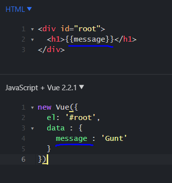
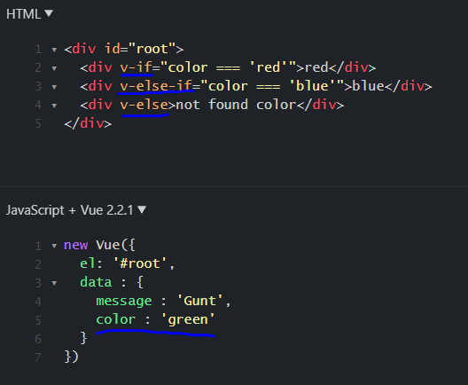

# **`VueJsDojo`**

## **`VueJs(V.2)`**

=> front-end framework ที่เอาไว้ทำ Web Application โดยใช้ Javascript ในการเขียน

## **`Why VueJs?`**

- เขียนด้วย HTML,CSS,Javascript ที่ใช้เขียนในหลายๆ framework
- เขียนง่าย Learning curve ไม่สูง
- มีขนาดของ project ที่เล็ก (ไม่กี่ KBs)
- implement บน Virtual DOM ที่มีประสิทธิภาพในการอัพเดท DOM (Document Object Model)
- แยก UI, Business Logic ออกจากกัน
- fast dev เพราะเป็น reuseable code

`Note : ` DOM (Document Object Model) คือ Object ของ HTML ที่ Web Browser สร้างขึ้นมาเมื่อหน้าเว็บโหลดเสร็จ

- tag ต่างๆใน HTML จะเรียกว่า Element(DOM)
- เราใช้ DOM HTML ในการเข้าถึง Element(tag) ต่างๆ ผ่านคำสั่งของ Javascript

## **`Basic For VueJs`**

## _`Vue Instance`_

=> เป็น Object ที่สร้างจาก `new Vue()` โดยข้างในก็จะมี property ต่างๆที่จัดการเกี่ยวกับ view model

;

- property el จะ ref ถึง element ใน DOM
- property data จะ ref data ของ component
- binding data ใช้ `{{ }}` ครอบ data ที่ต้องการจะ bind

## _`Directives`_

### **v-model**

=> เป็นการ binding แบบ Two-Way data

;

### **v-if**,**v-else-if**,**v-else**

;

## _`Methods`_

## _`Data-Binding`_

### **simple binding**

=> ใช้ `{{ }}` ครอบ data ที่ต้องจะ bind

### **v-model**

=> เป็นการ binding แบบ Two-Way data

;

## _`Events`_

## _`Filters`_

## _`Computed Properties`_

## _`Components`_

## _`Component Lifecycle`_
